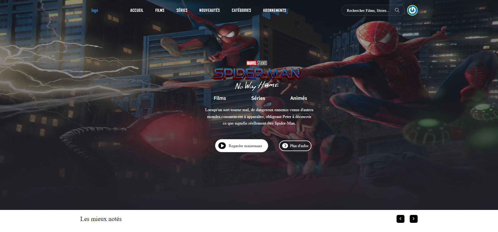
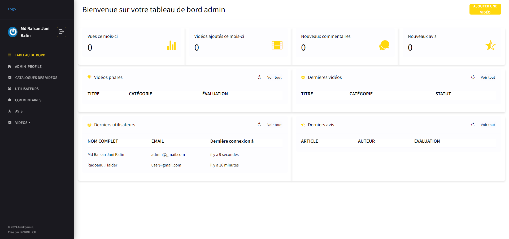
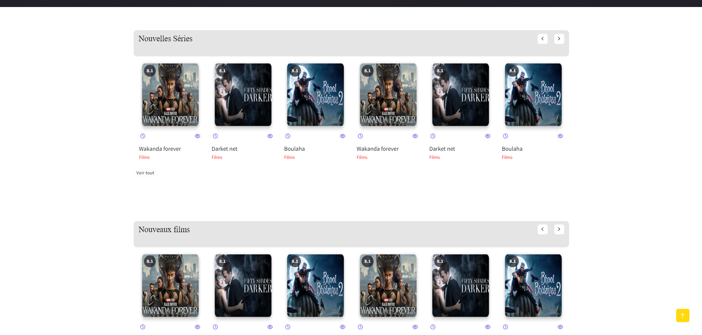
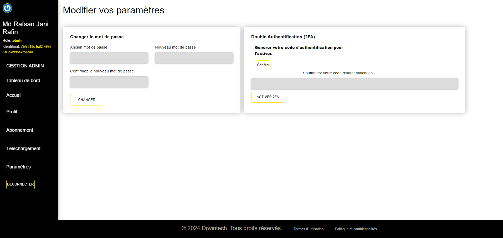
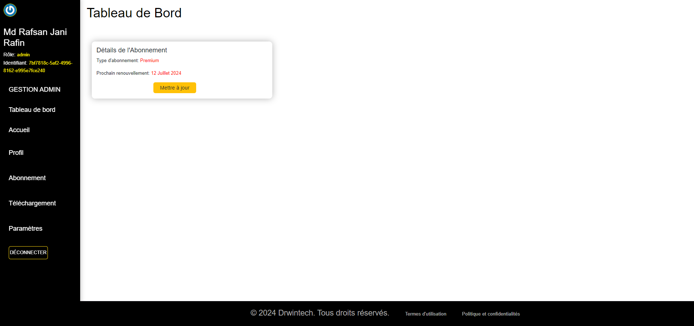

# Filmkpamin

Filmkpamin est une application de streaming pour les videos Béninois créer par Drwintech.

> Si vous aimer n'hésiter pas a laissé un j'aime ! ⭐

## 💻 Installation Instructions

-   Cloner le projet.

```shell
cd Filmkpamin

composer install

cp .env.example .env

php artisan key:generate

php artisan jwt:secret

php artisan storage:link
```

-   Modifiez le fichier `.env` avec vos identifiants pour la `base de données`, `Pusher` et autres.
-   Consultez le fichier `.env.example` pour plus de détails.

```shell
php artisan migrate:fresh --seed
```

-   Installer et construire

````shell
npm install && npm run production
 


-   Lancer l'application

```shell
php artisan serve
````

-   voir [http://localhost:8000/](http://localhost:8000/)

-  Exécutez également ces commandes dans des onglets de console séparés pour que les files d'attente et les programmations fonctionnent :

```shell
php artisan schedule:work

php artisan queue:work
```

## 📷 Screenshots











